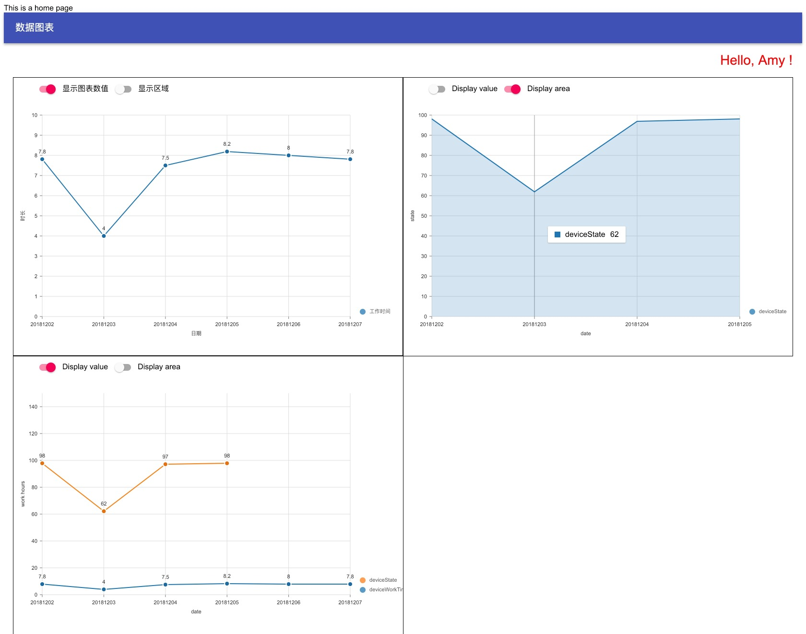

# Common-web-client

 

这是一个纯手动创建的react框架，没有使用脚手架初始化。所有的项目构成依照react的设计搭建。
设计技术： react, redux, webpack, express, lerna

[The IoT dashboard is based on this demo](https://gitlab.com/NoroLinxy/iot-web-client)

## Set up

- 安装所有内/外依赖包 `npm run link-packages`。
- 将路由复制到mock的后端 `npm run update:routes`。
- 安装中遇到问题可以执行 `npm run clean` 删除所有依赖包，并`npm run ready`将重新安装依赖包并更新路由。

### Run dev mode

使用webpack-dev-middleware这中间件自己搭建server, webpack的打包文件都保存在内存中。

1. `npm run start:dev` 在开发模式下启动
2. 浏览器地址<http://localhost:3000/test/#/>

## Unit tests

单元测试（unit test）使用jasmine来写测试用例，框架使用karma运行在chrome headless。 覆盖率用istanbul。
使用jasmine和karma自己搭建而不选用其他自带框架在于使用jasmine可以用在端到端测试，避免使用不同的框架测试语句。

_包含lint修改._

1. 运行 `npm run test:unit` 开始单元测试。
2. **packages/\*/tests/out/unit**  UT 报告。
3. **packages/\*/tests/out/coverage**  UT 覆盖率报告。

## E2e tests

使用protractor来初始化端到端测试（e2e test）， 使用jasmine来写测试用例

1. 启动前端项目 `npm run start:dev` 这里的目的是启动mockup server和前端开发的server。
2. 启动端到端测试 `npm run test:e2e` 确保Chrome安装。
3. **packages/\*/tests/out/e2e**  端到端测试报告。

## Static Analysis (Eslint)

默认的基础规则为eslint-config-airbnb， 而后又引入了其他规则和自定义规则来补充。

规则检查使用 `npm run check:lint`

## Coding style

使用Prettier来规范书写

运行 `npm run format` 将自动复写部分不规范方法。
运行 `npm run format:dry` 将只列出不规范的地方，不做人和修改

自动修改被挂载在pre-commit上，因此不用特别执行
